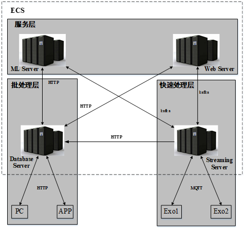
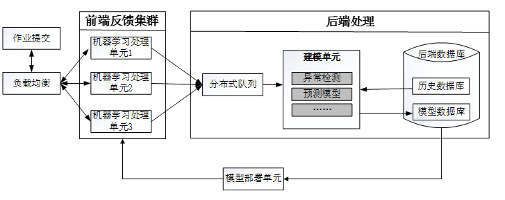
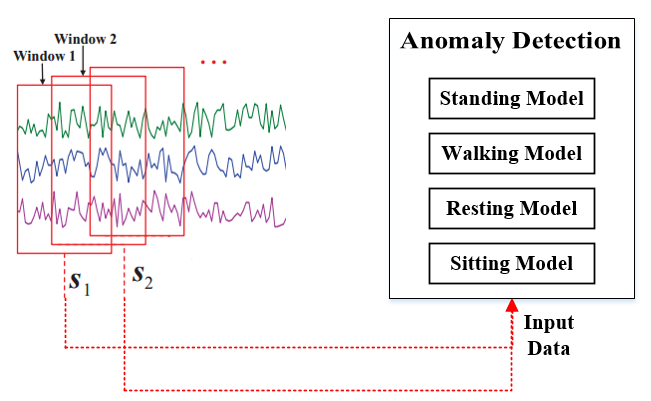
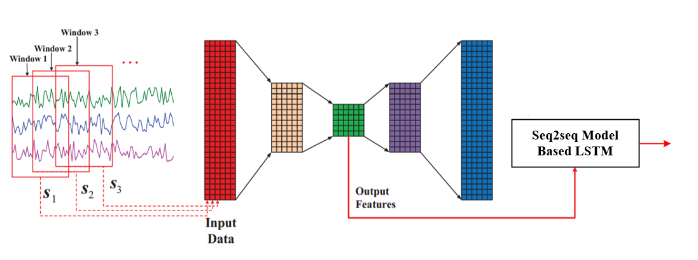
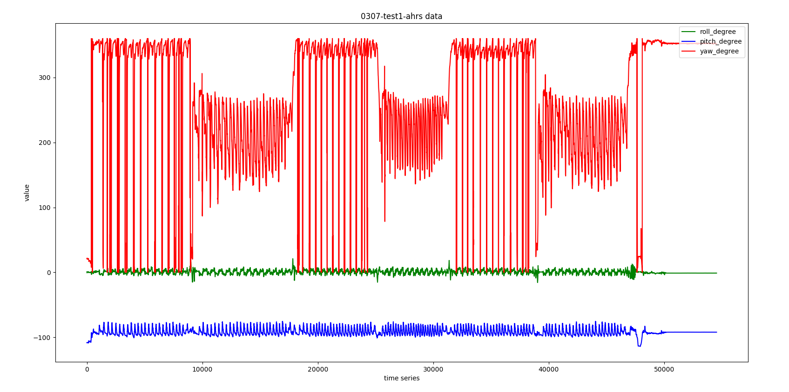
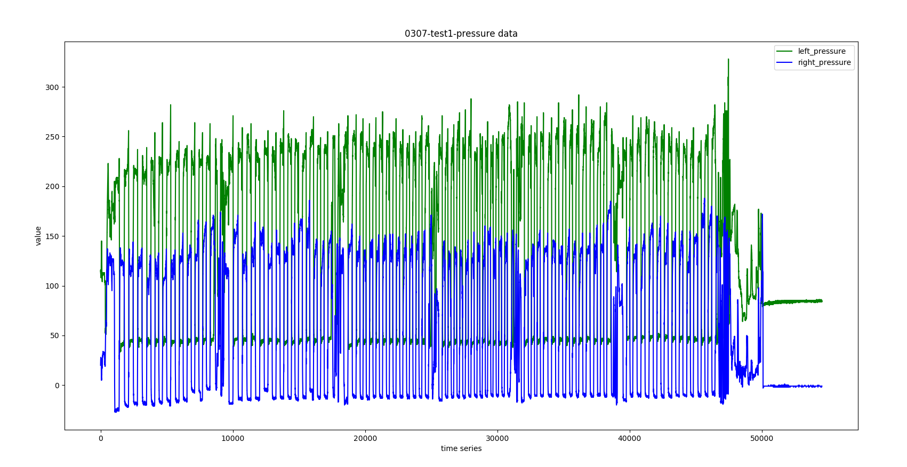
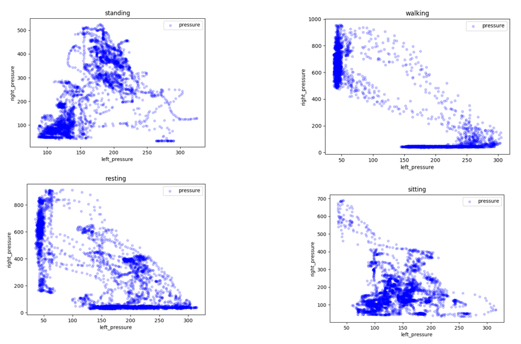
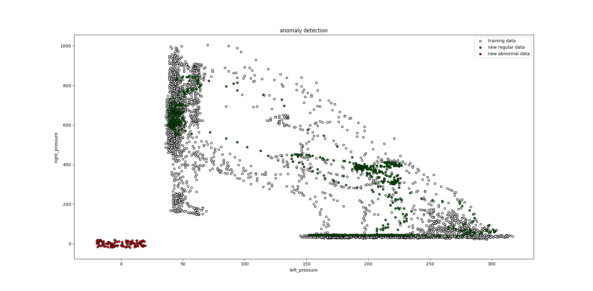
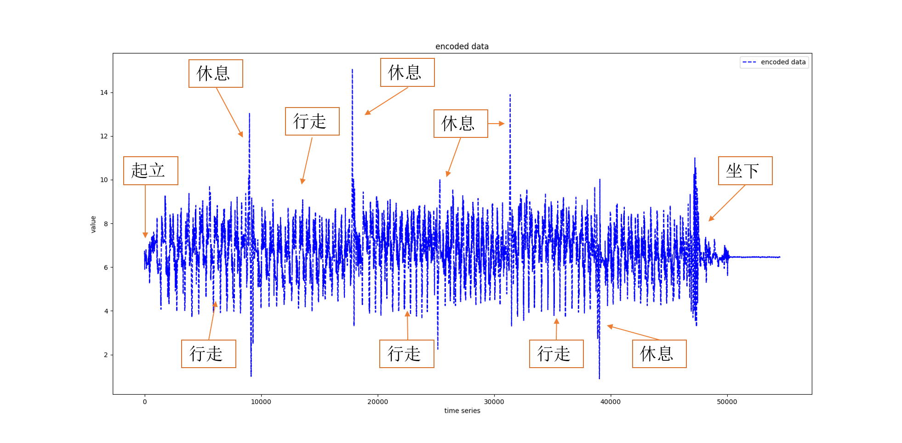
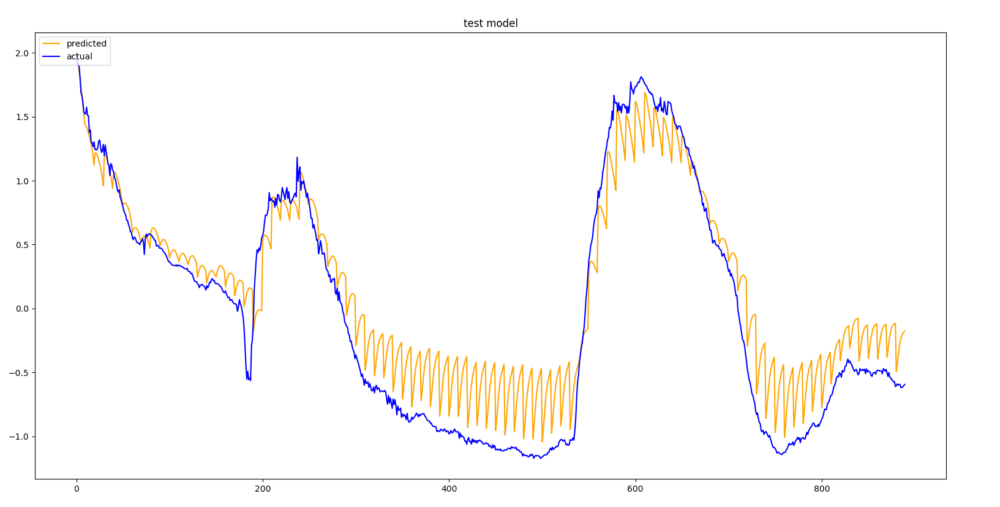

# 硕士毕业2年半，我的这个工作被实验室整理成论文《Exoskeleton Cloud-Brain Platform and Its Application in Safety Assessment》，发表在SCI期刊《Assembly Automation》2020年影响因子/JCR分区：1.582/Q3

## 主要思路

	1、实体机器人通过云脑机器人架构，在云端形成了克隆模型的虚拟机器人，每个虚拟机器人拥有实体机器人的传感器数据。

    2、信息融合：通过将多维度的传感器数据通过Auto Encoder进行降维和去噪，形成高浓缩的特征，使得下游其他机器学习任务更加精确。

    3、利用iForest进行异常检测，利用基于LSTM的seq2seq进行预测

首先，云脑机器人架构如下所示：

ML server与前端Web Server整体架构如下：

每一个人机状态在云端都有一个智能体，也就是机器学习处理单元，而每一个机器学习处理单元可以包含诸多模型，目前这里只有异常检测模型和预测模型。

## 异常检测

异常检测模型为：

首先，将实时的流式数据通过滑动窗口的方式经过提前训练好的四种模型，然后将每一个模型得到的窗口中数据的正常概率求和，最后与设定的阈值进行比较，大于阈值则为正常，小于阈值则为不正常。

## 状态预测

预测模型为：

## 实验结果

1、实时传感器数据如下图所示：

2、将左右脚压力传感器scatter可视化以后如下图：

异常检测效果示意图：

3、将前面5个维度通过Auoto Encoder降低到一维之后如下图所示：

5、利用seq2seq进行预测：利用前100个点(1s)的数据预测往后10(0.1s)的数据值

